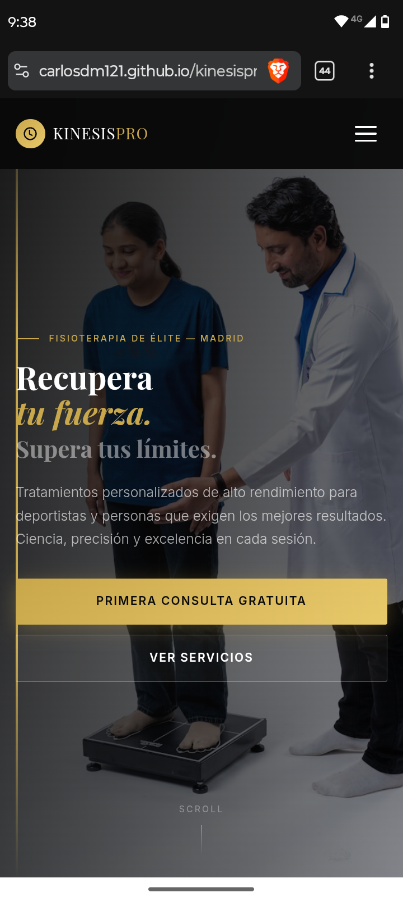

<div align="center">


# KinesisPro — Fisioterapia de Élite

</div>

<p align="center">
  Landing page premium para clínica de fisioterapia de alto rendimiento.
  Diseño elegante con estética minimalista, acentos dorados y animaciones fluidas.
</p>

## Preview

<p align="center">
  
</p>

## Demo

<p align="center">
<a href="https://carlosdm121.github.io/kinesispro/" target="_blank">
  
</a>
</p>

---

## Descripción

KinesisPro es una landing page de nivel profesional diseñada para una clínica de fisioterapia de élite en Madrid. La página combina un diseño visual impactante con una experiencia de usuario fluida, completamente responsive y optimizada para todos los dispositivos.

La estética se basa en una paleta oscura con acentos dorados (`#C9A84C`), tipografía serif premium **Playfair Display** combinada con la sans-serif **Inter**, y animaciones sutiles que transmiten profesionalismo y exclusividad.

## Estructura de la Página

### Navegación
- **Navbar fija** con efecto de blur/glass al hacer scroll
- **Menú hamburguesa** animado para móvil con transición slide
- **Navegación desktop** con links de hover dorado y botón CTA
- Cierre automático del menú móvil al seleccionar un enlace

### Hero Section
- Pantalla completa (`100dvh`) con imagen de fondo y overlay degradado
- Línea de acento dorada vertical lateral
- Tipografía de alto impacto con texto en itálica dorada
- Dos botones CTA (primario dorado + secundario outline)
- Indicador de scroll animado con pulso
- Efecto parallax en la imagen de fondo

### Servicios
- Grid responsive (1 → 2 → 4 columnas)
- 4 tarjetas de servicio con iconos SVG dorados
- Efecto hover con elevación y sombra
- Cards: Fisioterapia Deportiva, Rehabilitación, Terapia Manual, Fisioterapia Neurológica

### Sobre Nosotros
- Layout en dos columnas en desktop (imagen + texto)
- Imagen con barra de acento dorada vertical
- Estadísticas animadas: +2500 pacientes, 14 años, 98% satisfacción
- Texto descriptivo con tipografía jerarquizada

### Equipo
- Grid de perfiles (1 → 3 columnas)
- 3 tarjetas con foto, nombre y especialidad
- Imágenes con border-radius y proporción optimizada

### Testimonios
- Sección con fondo oscuro para contraste visual
- Grid de testimonios (1 → 2 → 3 columnas)
- Tarjetas con fondo semi-transparente y borde sutil
- Avatar circular del autor + nombre + rol/profesión

### Contacto
- Layout en dos columnas: información + formulario
- 4 items de contacto con iconos circulares dorados (dirección, teléfono, email, horario)
- Formulario con validación HTML5: nombre, email, teléfono, mensaje
- Botón de envío con efecto hover
- Alert de confirmación con el nombre del usuario

### Footer
- Logo + redes sociales (Instagram, Facebook, LinkedIn)
- Iconos sociales con hover dorado
- Copyright dinámico

## Tecnologías Utilizadas

| Tecnología | Uso |
|---|---|
| **HTML5** | Estructura semántica con `section`, `nav`, `footer`, `form` |
| **CSS3** | Custom Properties, Grid, Flexbox, Media Queries, animaciones `@keyframes`, gradientes, `backdrop-filter` |
| **JavaScript Vanilla** | IntersectionObserver (fade-in), parallax, menú hamburguesa, smooth scroll, efectos de navbar |
| **Google Fonts** | Playfair Display (serif premium) + Inter (sans-serif moderna) |
| **SVG Inline** | Iconos de servicios, contacto y redes sociales sin dependencias externas |

## Responsive Design

La página está optimizada con **4 breakpoints**:

| Breakpoint | Dispositivos |
|---|---|
| `< 360px` | Teléfonos pequeños (iPhone SE, Galaxy A12) |
| `≥ 480px` | Tablets pequeños / teléfonos grandes |
| `≥ 768px` | Tablets y laptops pequeñas |
| `≥ 1024px` | Desktops |
| `≥ 1280px` | Pantallas grandes |

Características responsive:
- Grid adaptativo de columnas (1 → 2 → 4 en servicios, 1 → 3 en equipo/testimonios)
- Navbar: menú hamburguesa en móvil → links expandidos en desktop
- Tipografía escalable que crece con cada breakpoint
- Botones del hero en columna (móvil) → fila (desktop)
- Secciones de about y contacto en columna (móvil) → grid (desktop)
- Uso de `100dvh` para hero con soporte perfecto en móviles

## Efectos y Animaciones

- **Parallax** — La imagen del hero se desplaza más lento que el contenido
- **Fade-in al scroll** — Elementos aparecen con `IntersectionObserver` y transición de opacidad
- **Scroll indicator** — Línea dorada con animación de pulso infinito
- **Hamburger menu** — Transformación de las 3 barras a X con rotación CSS
- **Hover en cards** — Elevación con `translateY` + sombra dinámica
- **Navbar blur** — `backdrop-filter` con desenfoque para efecto glass
- **Botones** — Elevación y cambio de sombra en hover

## Estructura del Proyecto

```
fisiopro/
├── index.html                          # Página principal
├── _componentsv2/                      # Componentes CSS/JS reutilizables
│   ├── 8591fc18463c4f94f3ab2bdfe22c27f08683fd26.css
│   └── 8591fc18463c4f94f3ab2bdfe22c27f08683fd26.js
├── _runtimes/                          # Runtime scripts
│   └── sites-runtime.*.js
├── fonts.googleapis.com/               # Fuentes precargadas
│   └── css2
├── images.umplash.com/                 # Imágenes locales
│   └── *.jpeg
└── README.md                           # Documentación del proyecto
```

## Despliegue

El proyecto está desplegado mediante **GitHub Pages** desde la rama `main`.

```bash
# Clonar el repositorio
git clone https://github.com/carlosdm121/kinesispro.git

# Acceder al directorio
cd kinesispro

# Abrir en el navegador
open index.html
```

---

<div align="center">

**KinesisPro** — Ciencia, precisión y excelencia en cada sesión.

</div>
